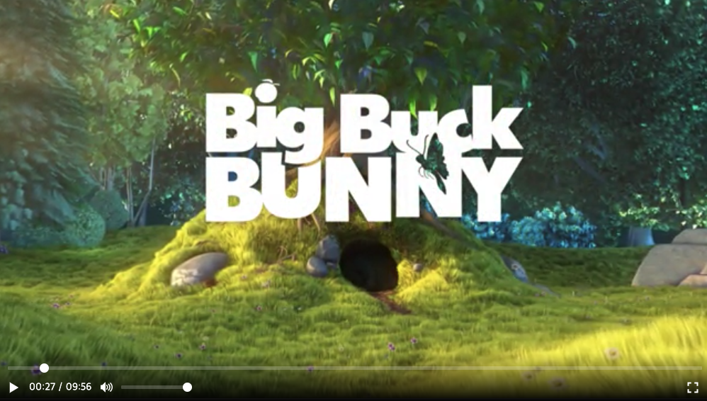

# BetterPlayer.js

확장 가능한 웹 비디오 플레이어



## Table of Contents

- [Install](#Install)
- [Quick Start](#Quick-Start)
- [API Documents](#API)
- [Customizing](#Customizing)

## Install

```text
$ npm install @mando212/better-player
```

## Quick Start

### HTML

다음과 같이 body 태그에 엘리먼트를 준비합니다.

```javascript
<body>
  <div id="player"></div>
</body>
```

### CSS

기본 스타일을 적용하기 위해서 패키지의 `/dist/better-player.css` 파일을 다음과 같이 head 태그에 추가합니다.

```html
<head>
  <link rel="stylesheet" href="path/to/better-player.css" />
</head>
```

또는, CDN을 이용해서 다음과 같이 스타일을 추가할 수 있습니다.

```html
<head>
  <link
    rel="stylesheet"
    href="https://unpkg.com/@mando212/better-player/dist/better-player.css"
  />
</head>
```

### Javascript

이제 모듈을 불러와 비디오 플레이어를 생성하세요.

```javascript
import BetterPlayer from '@mando212/better-player';

const player = new BetterPlayer.Player({
  source: 'http://your.video/here.mp4',
  parentId: 'player',
});
```

또는, CDN을 이용할 수도 있습니다. 이 경우 `BetterPlayer` 변수를 전역 환경에서 사용할 수 있습니다.

```html
<script src="https://unpkg.com/@mando212/better-player/dist/better-player.bundle.js"></script>
```

### 환경 설정

비디오 플레이어 인스턴스를 생성할 때 `BetterPlayer.Player`에 객체를 인자로 사용할 수 있습니다. 이 객체를 옵션 객체라고 부릅니다.

```jsx
const options = {
  source: 'http://path.to/video.mp4',
  parentId: 'player',
};

const player = new BetterPlayer.Player(options);
```

옵션 객체는 다음과 같은 속성을 가집니다.

**parent: HTMLElement**

비디오 플레이어가 생성될 DOM 엘리먼트를 설정합니다.

**parentId: string**

비디오 플레이어가 생성될 DOM 엘리먼트의 id 속성을 설정합니다. parent와 parentId 속성이 동시에 제공될 경우 parentId를 우선합니다.

**source: string**

비디오 소스의 URL을 설정합니다.

**width: number**

비디오 엘리먼트의 너비를 px 단위로 설정합니다. width가 제공되지 않을 경우 부모 엘리먼트의 너비를 따릅니다.

**height: number**

비디오 엘리먼트의 높이를 px 단위로 설정합니다. height가 제공되지 않을 경우 부모 엘리먼트의 높이를 따릅니다.

**clickToPlay: boolean**

비디오 클릭으로 영상을 재생합니다. 기본값은 true이며 이 기능을 사용하고 싶지 않을 경우 false를 입력하세요.

**keyboard: boolean**

키보드 단축키를 사용할 지 결정합니다. 기본 값은 true입니다

**seekTime: number**

되감기나 앞으로감기 시 이동할 초 단위의 값. 기본값은 5 입니다.

**volumeStep: number**

키보드 단축키로 볼륨을 조절할 시 이동할 볼륨 단계. 0 이상 1 이하의 값이며, 기본 값은 0.1 입니다.

**i18n: object**

텍스트의 국제화와 지역화를 위해 사용되는 객체입니다. 자세한 속성 값은 [defaults.js](https://github.com/youngdo212/better-player/blob/develop/src/config/defaults.js)를 참고하세요.

**iconUrl: string**

아이콘 svg sprite를 별도 제공하고 싶은 경우, sprite url을 직접 입력합니다. 자세한 내용은 [Customizing](#아이콘-별도로-제공하기)을 참고 하세요.

## API

### Methods

**isPaused(): boolean**

재생 여부를 반환합니다.

```javascript
const isPaused = player.isPaused();
```

**getCurrentTime(): number**

초 단위의 현재 시간을 반환합니다.

```jsx
const currentTime = player.getCurrentTime();
```

**getDuration(): number**

영상의 총 길이를 초 단위로 반환합니다. 비디오의 메타데이터가 로드되기 전에 호출하면 NaN을 반환합니다.

```jsx
const duration = player.getDuration();
```

**getVolume(): number**

0 이상 1 이하의 값으로 영상의 볼륨을 반환합니다.

```jsx
const volume = player.getVolume();
```

**isMuted()**: boolean

영상의 음소거 여부를 반환합니다. 볼륨이 0일때도 true를 반환합니다.

```jsx
const isMuted = player.isMuted();
```

**isFullscreen(): boolean**

비디오 플레이어의 전체화면 여부를 반환합니다.

```jsx
const isFullscreen = player.isFullscreen();
```

**play(): void**

영상을 재생합니다.

```javascript
player.play();
```

**pause(): void**

영상을 일시 정지합니다.

```javascript
player.pause();
```

**seek(time): void**

- time: number - 초 단위의 값

초 단위로 영상을 탐색합니다. 0 이하의 값을 입력하면 영상을 처음으로 되돌립니다.

```jsx
player.seek(30);
```

**setVolume(volume): void**

- volume: number - 0 이상 1 이하의 값

비디오 플레이어의 볼륨을 조절합니다.

```jsx
player.setVolume(0.4);
```

**mute(): void**

비디오 플레이어를 음소거 합니다.

```jsx
player.mute();
```

**unmute(): void**

비디오 플레이어의 음소거를 해제합니다.

```jsx
player.unmute();
```

**requestFullscreen(): void**

비디오 플레이어를 전체 화면으로 전환합니다.

```jsx
player.requestFullscreen();
```

**exitFullscreen(): void**

비디오 플레이어를 전체화면에서 나오게 합니다.

```jsx
player.exitFullscreen();
```

**on(event, handler[, context]): void**

비디오 플레이어에 이벤트 핸들러를 등록합니다.

- event: string - 이벤트 이름
- handler: function - 이벤트 핸들러
- (optional)context: object - 이벤트 핸들러 호출 시 this로 참조할 객체

```jsx
player.on('play', () => {
  // do something ...
});
```

**off(event, handler): void**

비디오 플레이어에 등록한 이벤트 핸들러를 삭제합니다.

- event: string - 이벤트 이름
- handler: function - 삭제할 이벤트 핸들러

```jsx
player.off('play', addedHandler);
```

**once(event, handler): void**

비디오 플레이어에 한 번만 실행할 이벤트 핸들러를 등록합니다.

- event: string - 이벤트 이름
- handler: function - 이벤트 핸들러

```jsx
player.once('play', () => {
  // do something ...
});
```

**destroy(): void**

인스턴스를 파괴하고 등록된 이벤트 핸들러를 전부 제거합니다. 또한 생성된 엘리먼트들도 전부 제거합니다. parent 엘리먼트는 남아있습니다.

```jsx
player.destroy();
```

### Events

비디오 플레이어는 다양한 이벤트를 발생합니다. 이벤트 핸들러를 등록하고 싶다면 다음과 같이 작성할 수 있습니다.

```jsx
player.on('play', event => {
  handlePlay(event);
});
```

이벤트 목록은 아래와 같습니다.

- pause: 일시 정지할 때 발생. 리소스 부족으로 영상이 잠시 멈췄을 때는 발생하지 않는다(이는 waiting 이벤트 참고).

- play: 재생할 때 발생. 구체적으로는 재생 버튼을 눌렀을 때나 play() 메소드를 호출했을 때 발생한다.

- volumechange: 볼륨이 변경됐을 때 발생

- timeupdate: 영상의 현재 시간(getCurrentTime)이 변경됐을 때 발생

- ended: 끝까지 도달해서 영상이 멈췄을 때 발생.

- seeking: 탐색 작업이 시작됐을 때 발생

- seeked: 탐색 작업이 완료됐을 때 발생

- requestfullscreen: 전체화면으로 변경됐을 때 발생

- exitfullscreen: 전체화면에서 탈출했을 때 발생

## Customizing

다양한 방식으로 비디오 플레이어의 스타일을 변경할 수 있습니다.

### CSS 스타일링 하기

기본으로 제공되는 UI 스타일을 CSS custom properties를 이용해서 변경할 수 있습니다. CSS custom properties에 대해 자세히 알고 싶다면 [다음](https://developer.mozilla.org/en-US/docs/Web/CSS/Using_CSS_custom_properties)을 참고하세요.

BetterPlayer에서 제공하는 CSS custom properties 목록은 다음과 같습니다.

| 이름                                      | 설명                          | 기본값                             |
| ----------------------------------------- | ----------------------------- | ---------------------------------- |
| `--better-player-color-main`              | 비디오 플레이어의 메인 색상   | #fff                               |
| `--better-player-font-size`               | 비디오 플레이어의 폰트 사이즈 | 16px                               |
| `--better-player-font-color`              | 비디오 플레이어의 폰트 색상   | #fff                               |
| `--better-player-controller-background`   | 컨트롤러의 배경 색상          | linear-gradient(transparent, #000) |
| `--better-player-controller-spacing`      | 컨트롤러 유닛 간의 간격       | 5px                                |
| `--better-player-controller-icon-size`    | 컨트롤러 아이콘 크기          | 32px                               |
| `--better-player-controller-font-size`    | 컨트롤러 폰트 크기            | 15px                               |
| `--better-player-controller-color`        | 컨트롤러 아이콘 및 폰트 색상  | #fff                               |
| `--better-player-error-screen-icon-size`  | 에러 스크린의 아이콘 크기     | 36px                               |
| `--better-player-error-screen-icon-color` | 에러 스크린의 아이콘 색상     | #fff                               |

웹 페이지의 모든 플레이어에 적용하고 싶다면 다음과 같이 사용하세요.

```css
:root {
  --better-player-color-main: #f0f;
}
```

하나의 플레이어의 스타일을 변경하기 위해 다음과 같이 css selector를 이용할 수도 있습니다.

```css
.player {
  --better-player-color-main: #f0f;
}
```

### 아이콘 별도로 제공하기

BetterPlayer는 svg 아이콘을 사용하고 있습니다. 만약 자신만의 멋진 아이콘들이 svg 파일로 준비되어 있다면 옵션 객체의 `iconUrl` 속성을 이용해서 내 아이콘을 비디오 플레이어에 적용할 수 있습니다.

`iconUrl` 속성을 이용하고 싶다면 두 가지 사전 준비가 필요합니다.

1. 아이콘들이 전부 하나의 파일(svg sprite)에 들어가 있어야 합니다. svg sprite를 만드는 방법은 [다음](https://css-tricks.com/svg-sprites-use-better-icon-fonts/)을 참고하세요.
2. svg sprite에 들어있는 각 아이콘의 id 속성이 BetterPlayer의 아이콘 id와 일치해야 합니다.

| 아이콘                       | id                           |
| ---------------------------- | ---------------------------- |
| 컨트롤러 플레이 버튼         | better-player-play           |
| 컨트롤러 일시 정지 버튼      | better-player-pause          |
| 컨트롤러 음소거 버튼         | better-player-mute           |
| 컨트롤러 음소거 취소 버튼    | better-player-volume         |
| 컨트롤러 전체화면 버튼       | better-player-fullscreen-in  |
| 컨트롤러 전체화면 취소 버튼  | better-player-fullscreen-out |
| 에러 화면 비디오 리로드 버튼 | better-player-reload         |

svg sprite가 준비됐다면 아래와 같이 svg url을 입력할 수 있습니다.

```jsx
const player = new BetterPlayer.Player({
  ...,
  iconUrl: 'path/to/svg-sprite.svg'
});
```
